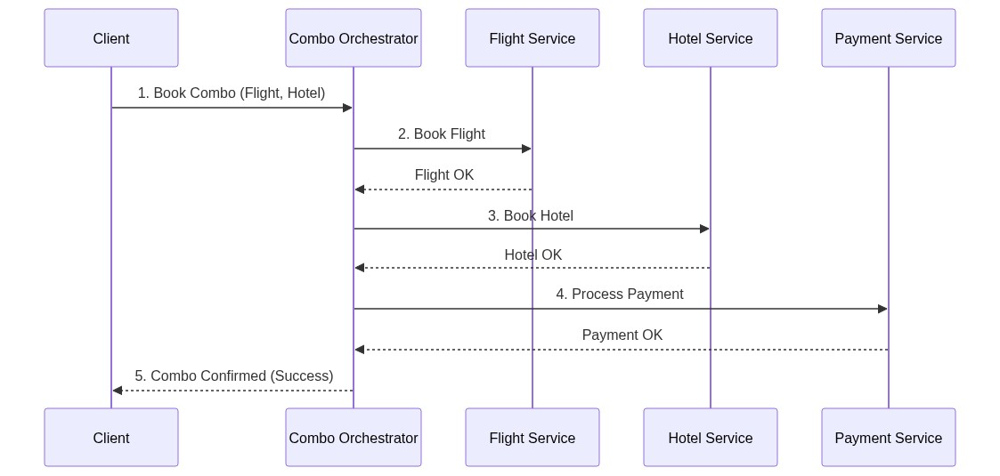

# Hồ Sơ Thiết Kế Hệ Thống Đặt Vé Combo "Chuyến Đi Trọn Gói"

## 1. Phân tích vấn đề

### Các dịch vụ tham gia
1. **Order Combo Service**: Dịch vụ trung tâm tiếp nhận yêu cầu từ người dùng, điều phối quá trình đặt combo.
2. **Flight Service**: Giao tiếp với API của đối tác hàng không để đặt vé máy bay.
3. **Hotel Service**: Giao tiếp với API của đối tác khách sạn để đặt phòng.
4. **Payment Service**: Xử lý thanh toán cho tổng đơn hàng (vé máy bay + khách sạn).

### Các bước trong luồng đặt combo (Happy Path)
1. Người dùng gửi yêu cầu đặt vé máy bay và khách sạn.
2. Hệ thống gọi `Flight Service` để đặt vé máy bay (giữ chỗ).
3. Hệ thống gọi `Hotel Service` để đặt phòng (giữ phòng).
4. Hệ thống gọi `Payment Service` để trừ tiền khách hàng.
5. Nếu tất cả thành công, combo được xác nhận (Confirmed).

### Các điểm có thể thất bại
- **Lỗi nghiệp vụ**: Máy bay hết chỗ, khách sạn hết phòng trống, thẻ ngân hàng từ chối/không đủ số dư.
- **Lỗi hệ thống/mạng**: Timeout khi gọi API đối tác, đối tác bảo trì, mất kết nối mạng.

## 2. Lựa chọn mô hình Saga

Trong bài toán này, tôi chọn mô hình **Saga Orchestration (Điều phối trung tâm)** thay vì Choreography.

**Lý do:**
- **Kiểm soát tập trung**: Luồng đặt vé (Flight -> Hotel -> Payment) có thứ tự logic rõ ràng. Sử dụng một Orchestrator (Combo Service) giúp dễ dàng theo dõi trạng thái hiện tại của toàn bộ transaction.
- **Tránh sự phức tạp của Event (Cyclic dependencies)**: Nếu dùng Choreography, các service Flight, Hotel, Payment sẽ phải tự lắng nghe event của nhau, dẫn đến phức tạp khi xử lý logic rollback (ví dụ: Hotel fail thì phải bắn event để Flight cancel).
- **Dễ xử lý Timeout và Retry**: Orchestrator đóng vai trò như bộ đếm thời gian, nếu một dịch vụ mất quá nhiều thời gian phản hồi, nó có thể trực tiếp chủ động hủy và gọi các hàm bù trừ (compensation).

## 3. Thiết kế kiến trúc

### Sơ đồ kiến trúc luồng dữ liệu (Saga Orchestration)

### Cơ chế bù trừ (Compensation)
- **Nếu Book Flight thất bại**: Orchestrator trả về lỗi ngay lập tức, không gọi Hotel hay Payment. (Không cần bù trừ).
- **Nếu Book Hotel thất bại**: Orchestrator gọi lệnh `Cancel Flight` thông qua Flight Service để hủy vé máy bay đã đặt trước đó.
- **Nếu Process Payment thất bại**: Orchestrator gọi lệnh `Cancel Hotel` và `Cancel Flight` để nhả phòng và nhả vé máy bay.
- **Nếu API Timeout**: Nếu sau số lần Retry nhất định mà API đối tác vẫn timeout, Orchestrator sẽ giả định là thất bại và kích hoạt toàn bộ chuỗi bù trừ (rollback các dịch vụ đã giữ chỗ thành công trước đó).

## 4. Xử lý tình huống đối tác phản hồi chậm

- **Timeout**: Thiết lập Timeout cho mỗi request HTTP gửi đến đối tác (ví dụ: `Connect Timeout = 5s`, `Read Timeout = 10s`). Nếu quá thời gian, API ném ra TimeoutException.
- **Retry**: Áp dụng Retry mechanism cho các lỗi liên quan đến kết nối mạng hoặc lỗi HTTP 5xx từ đối tác.
  - Sử dụng chiến lược *Exponential Backoff* (thử lại sau 2s, 4s, 8s).
  - Không retry với các lỗi HTTP 4xx (ví dụ 400 Bad Request, 404 Not Found) vì request đã sai logic thì retry sẽ không có tác dụng.
- **Compensate (Bù trừ)**: Nếu đã hết lượt Retry mà hệ thống vẫn không nhận được phản hồi (hoặc vẫn lỗi), Orchestrator sẽ quyết định **hủy giao dịch (Fail)** và tiến hành rollback các bước đã hoàn thành bằng cách gửi request Cancel tới các hệ thống tương ứng.

## 5. Hướng dẫn chạy mô phỏng (Source Code)

Hệ thống được thiết kế giả lập bằng **Spring Boot** sử dụng Rest API giả lập luồng Saga Orchestrator. 

**Các API test kịch bản:**
- `POST /api/combo/book?scenario=SUCCESS`: Thành công cả hai.
- `POST /api/combo/book?scenario=HOTEL_FAIL`: Flight thành công, Hotel thất bại -> Rollback Flight.
- `POST /api/combo/book?scenario=PAYMENT_FAIL`: Payment thất bại -> Rollback Hotel và Flight.
- `POST /api/combo/book?scenario=TIMEOUT_HOTEL`: Timeout khi gọi Hotel -> Bắn Exception, Retry (demo) -> Rollback Flight.
